# 🌱 FarmMate (FarmLink)

**FarmMate** is a modern, direct-to-consumer agricultural marketplace that connects farmers directly with buyers — eliminating intermediaries and empowering both sides with transparency, communication, and efficiency.

---

## 📸 UI Showcase

### 🚜 Farmer Experience

#### 🔐 Authentication

| Login                                    | Sign Up                                  |
| ---------------------------------------- | ---------------------------------------- |
| 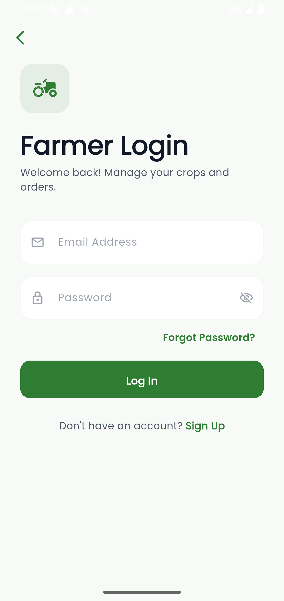 | 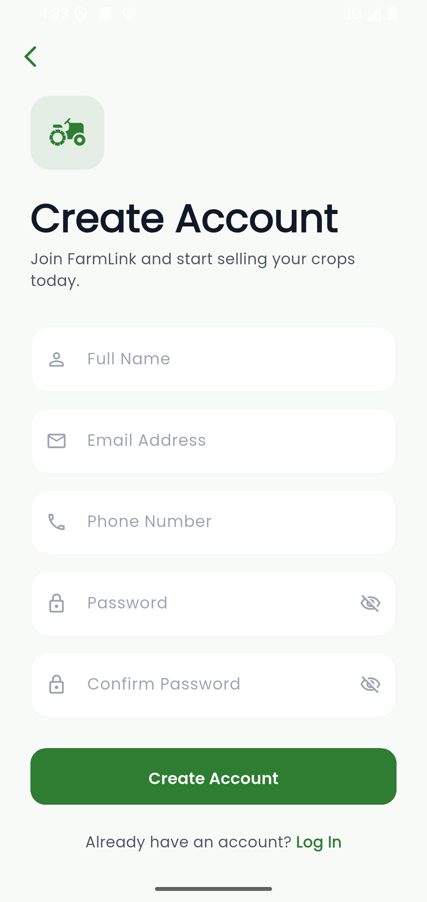 |

#### 🏠 Dashboard & Crops

| Home                                        | Add Crop                                     |
| ------------------------------------------- | -------------------------------------------- |
| 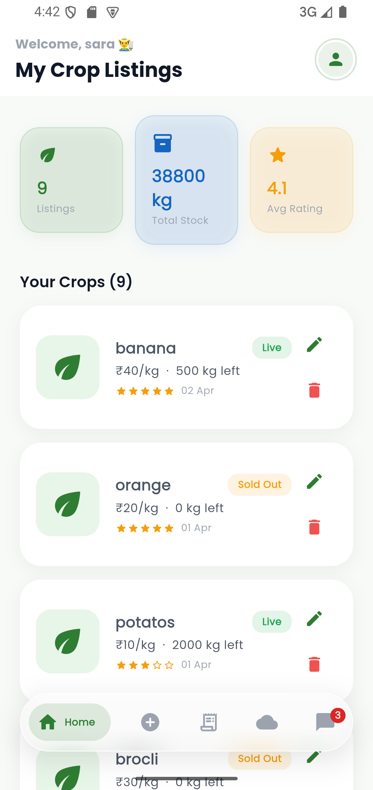 |  |
|                                             |  |

#### 📦 Orders & Chat

| Orders                                         | Chat                                         |
| ---------------------------------------------- | -------------------------------------------- |
| 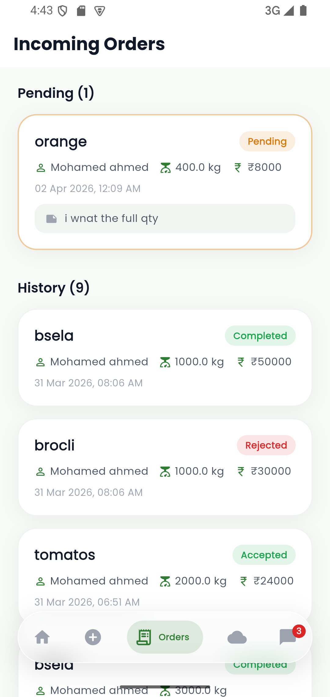 | 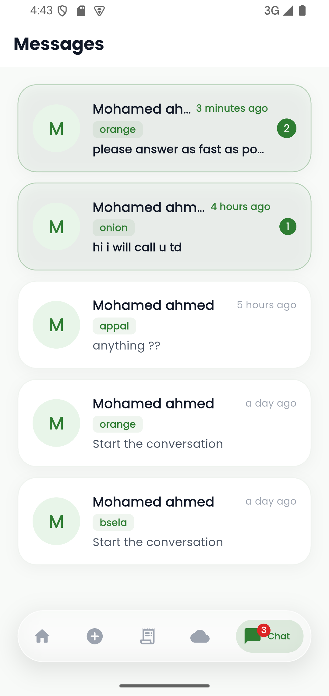 |

#### 🌦️ Weather Insights

| Weather 1                                       | Weather 2                                       |
| ----------------------------------------------- | ----------------------------------------------- |
| 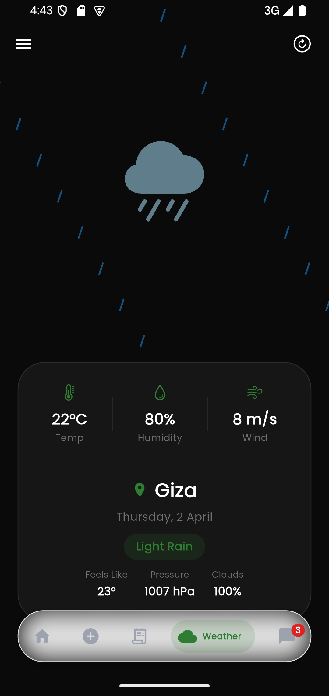 | 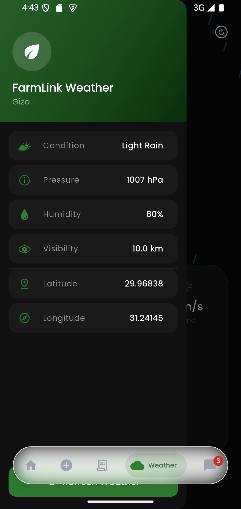 |

---

### 🛒 Buyer Experience

#### 🔐 Authentication

| Login                                  | Sign Up                                  |
| -------------------------------------- | ---------------------------------------- |
| 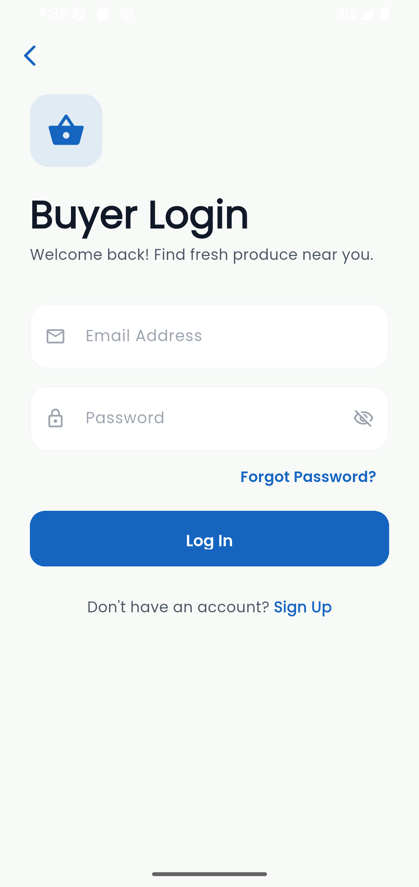 | 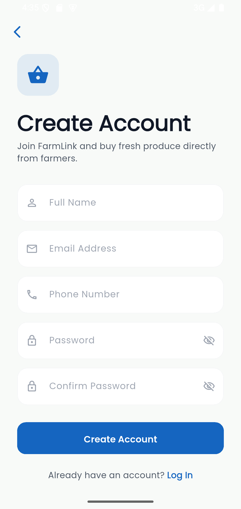 |

#### 🏪 Marketplace

| Home                                        | Crop Details                                   |
| ------------------------------------------- | ---------------------------------------------- |
| 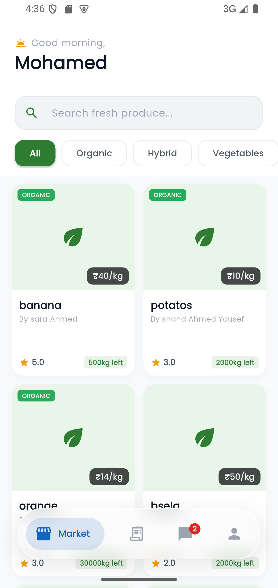 | 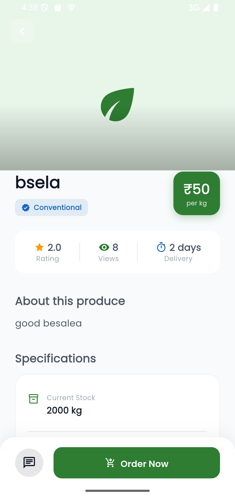   |
|                                             | 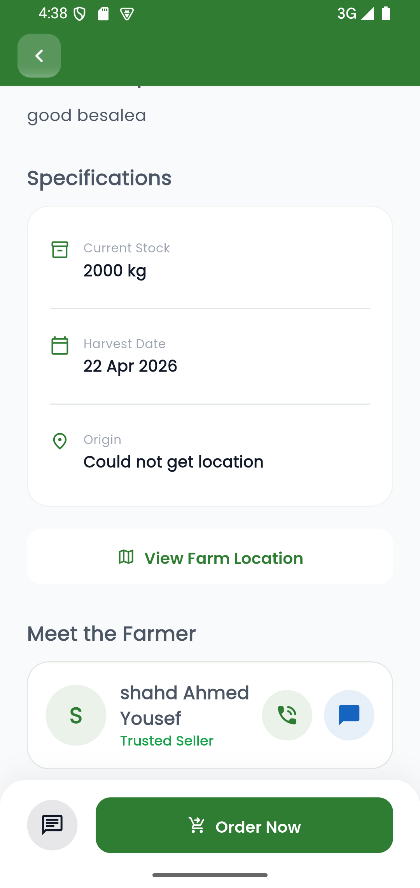 |

#### 🧾 Orders & Chat

| Orders                                       | Chat                                        |
| -------------------------------------------- | ------------------------------------------- |
| 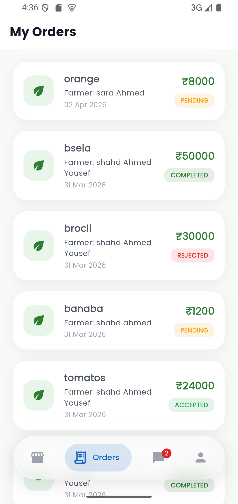 | 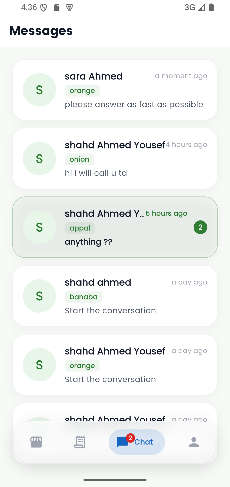 |

#### 👤 Profile

| Profile                                        |
| ---------------------------------------------- |
| 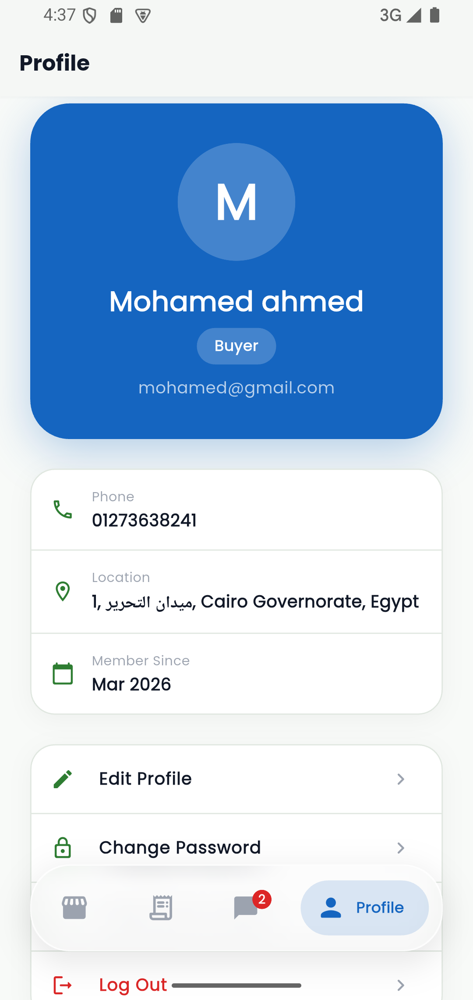 |

---

### 🌍 General Screens

| Welcome                             | Forgot Password                            |
| ----------------------------------- | ------------------------------------------ |
| 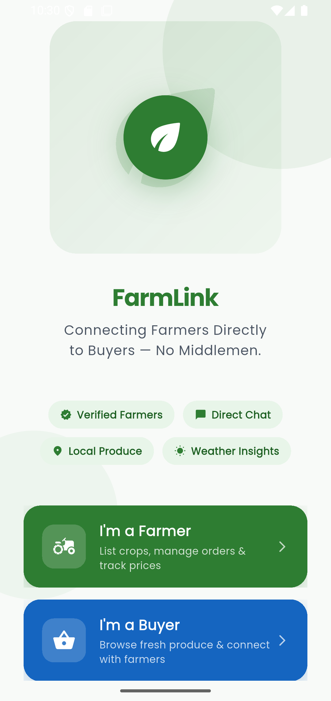 | 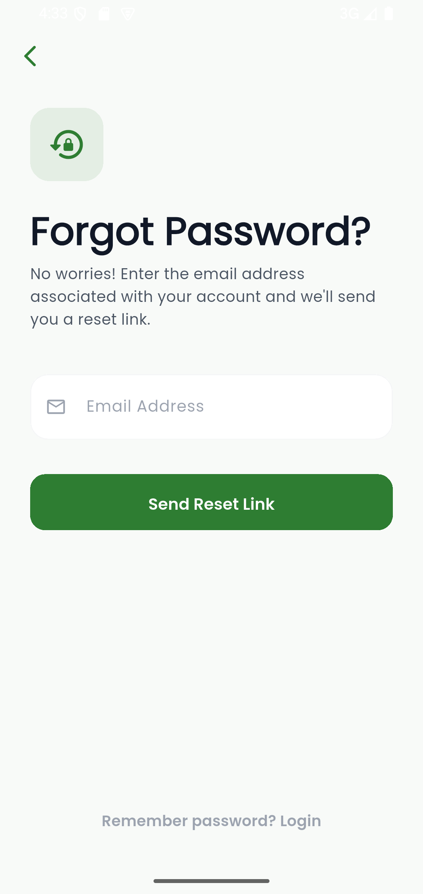 |

---

## 🚀 Features

### For Farmers 🚜

* 🌾 Crop Management with images, certification, and details
* 📦 Real-time order tracking
* 🌦️ Weather insights (Temp, Humidity, Wind)
* 📍 GPS-based farm location
* 💬 Direct chat with buyers

### For Buyers 🛒

* 🔍 Smart crop search & filtering
* 📊 Detailed product insights
* 🛍️ Seamless ordering system
* 🗺️ Farm location mapping
* 💬 Instant chat with farmers

---

## 🛠️ Technologies Used

### 📱 Frontend

* Flutter
* Riverpod
* GoRouter
* Flutter Animate
* ScreenUtil

### ☁️ Backend

* Firebase Authentication
* Cloud Firestore
* Firebase Storage

### 🔗 APIs & Services

* OpenWeather API
* Geolocator & Geocoding
* URL Launcher

---

## 🏗️ Architecture

Built with **Clean Architecture**:

* **Core:** Themes, constants, utilities
* **Domain:** Business logic (User, Crop, Order, Message)
* **Data:** Firestore & services
* **Presentation:** UI (Screens, Providers, Widgets)

---

## 📥 Getting Started

### Prerequisites

* Flutter SDK (v3.x)
* Firebase Account
* OpenWeather API Key

### Installation

```bash
git clone https://github.com/yourusername/FarmMate.git
cd FarmMate
flutter pub get
```

### Firebase Setup

1. Create project in Firebase Console
2. Add Android/iOS app
3. Download:

   * `google-services.json`
   * `GoogleService-Info.plist`
4. Enable:

   * Authentication
   * Firestore
   * Storage

### API Setup

Update:

```dart
lib/ApiKey.dart
```

### Run App

```bash
flutter run
```

---

## 🎥 Demo Video

https://drive.google.com/file/d/14hNO3rjDGU7xC1DDiB5gmI3jOX9joaeg/view?usp=sharing

---

## ❤️ Built With Purpose

Developed to empower farmers, simplify trade, and modernize agriculture.

---
